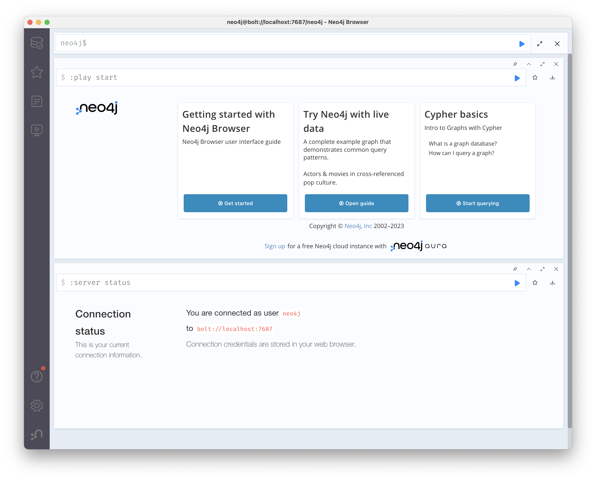
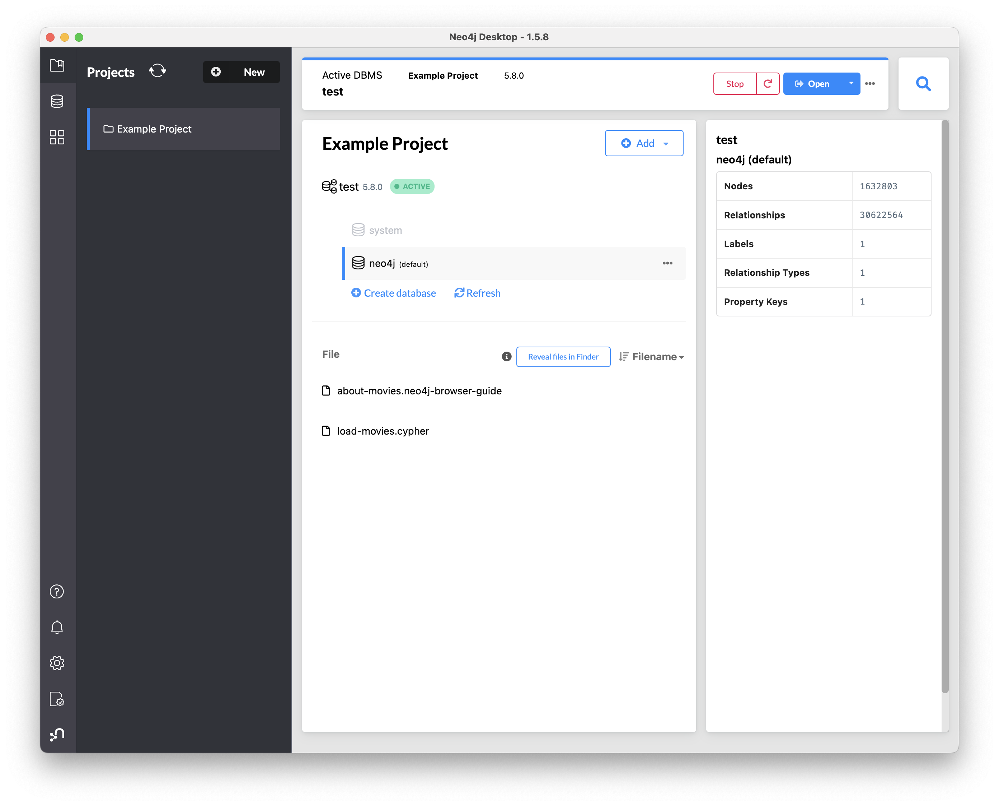
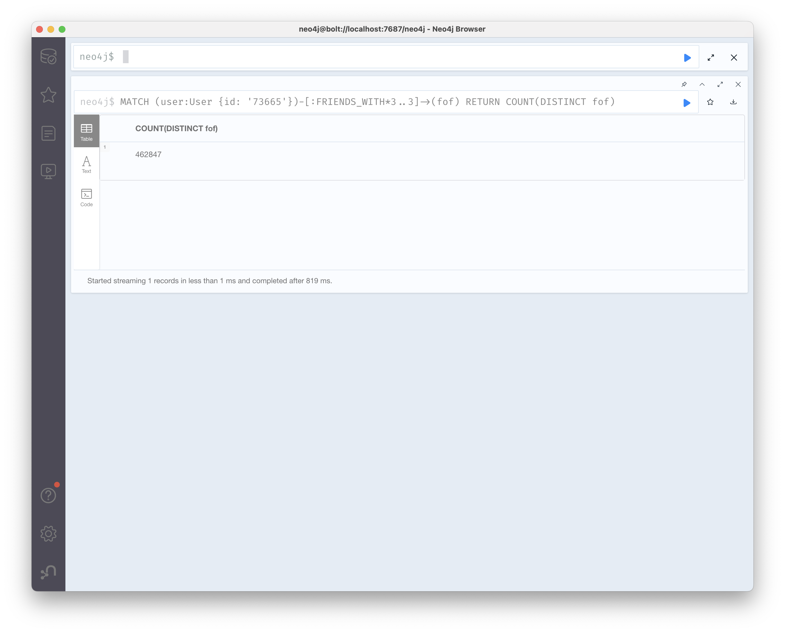
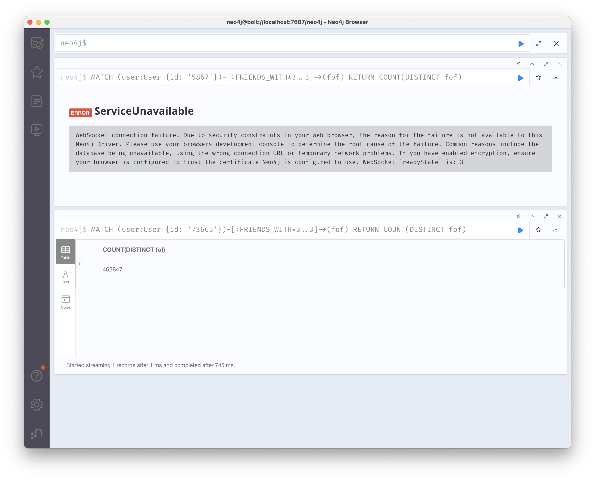
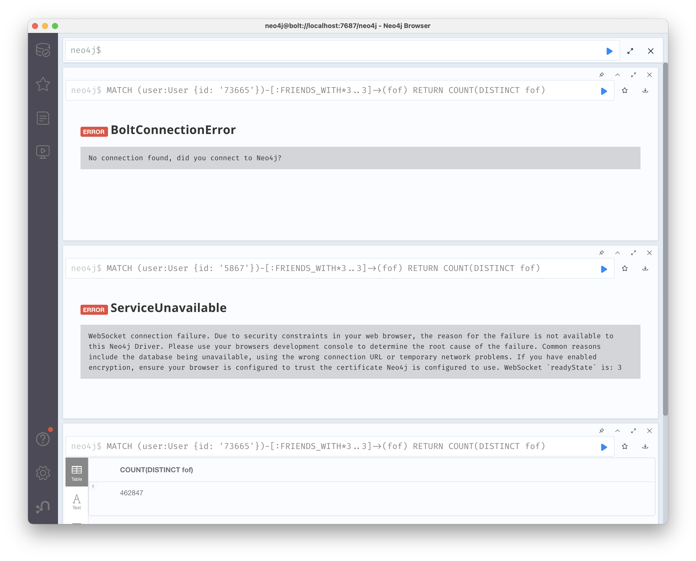

# graph-query-benchmarks
Benchmark experiments comparing PostgreSQL against other specialized graph databases

Experiments run on a MacBook Pro 16-inch 2021, Apple M1 Max, 64GB RAM.

```sh
wget https://snap.stanford.edu/data/soc-pokec-relationships.txt.gz
gunzip soc-pokec-relationships.txt.gz
createdb graphdb
psql graphdb
```

```sql
SELECT version();
-- PostgreSQL 15.2 on aarch64-apple-darwin21.6.0, compiled by Apple clang version 14.0.0 (clang-1400.0.29.102), 64-bit
ALTER SYSTEM SET work_mem TO '1GB';
ALTER SYSTEM SET shared_buffers TO '16GB';
ALTER SYSTEM SET effective_cache_size TO '48GB';
```

```sh
pg_ctl restart # or Stop/Start via e.g. Postgres.app
```

```sql
CREATE TABLE friendships (user_1 INT, user_2 INT);
\COPY friendships FROM 'soc-pokec-relationships.txt';
-- COPY 30622564
-- Time: 6281.634 ms (00:06.282)
CREATE TABLE users AS
SELECT user_1 AS id FROM friendships
UNION
SELECT user_2 FROM friendships;
-- SELECT 1632803
-- Time: 11167.841 ms (00:11.168)
ALTER TABLE users ADD PRIMARY KEY (id);
-- Time: 485.167 ms
ALTER TABLE friendships ADD PRIMARY KEY (user_1, user_2);
-- Time: 9070.741 ms (00:09.071)
```

User 5867 is the user with most friends (8763 friends).
We will use this as a worse-case in the benchmark.


```sql
SELECT user_1, COUNT(*) FROM friendships GROUP BY 1 ORDER BY 2 DESC LIMIT 1;
```
```
 user_1 | count
--------+-------
   5867 |  8763
(1 row)

Time: 1294.654 ms (00:01.295)
```

We will also pick the 100th most connected user, since it's not wise to base
a benchmark on the most extreme case.

```sql
SELECT user_1, COUNT(*) FROM friendships GROUP BY 1 ORDER BY 2 DESC LIMIT 1 OFFSET 100;
```
```
 user_1 | count
--------+-------
  73665 |   802
(1 row)

Time: 1302.048 ms (00:01.302)
```

```sql
WITH RECURSIVE friends_of_friends AS
(
    SELECT 
        ARRAY[5867::INTEGER] AS current,
        0 AS depth
    UNION ALL
    SELECT
        new_current,
        friends_of_friends.depth + 1
    FROM
        friends_of_friends
    CROSS JOIN LATERAL (
        SELECT
            array_agg(DISTINCT friendships.user_2) AS new_current
        FROM
            friendships
        WHERE
            user_1 = ANY(friends_of_friends.current)
    ) q
    WHERE
        friends_of_friends.depth < 3
)
SELECT
    cardinality(current)
FROM
    friends_of_friends
WHERE
    depth = 3;
;
```
```
 cardinality
-------------
     1035293
(1 row)

Time: 1782.385 ms (00:01.782)
```

```sql
WITH RECURSIVE friends_of_friends AS
(
    SELECT 
        ARRAY[73665::INTEGER] AS current,
        0 AS depth
    UNION ALL
    SELECT
        new_current,
        friends_of_friends.depth + 1
    FROM
        friends_of_friends
    CROSS JOIN LATERAL (
        SELECT
            array_agg(DISTINCT friendships.user_2) AS new_current
        FROM
            friendships
        WHERE
            user_1 = ANY(friends_of_friends.current)
    ) q
    WHERE
        friends_of_friends.depth < 3
)
SELECT
    cardinality(current)
FROM
    friends_of_friends
WHERE
    depth = 3;
;
```
```
 cardinality
-------------
      462847
(1 row)

Time: 298.856 ms
```

1. Install `Neo4j Desktop-1.5.8.dmg`
2. In the Example Project, Stop the "Movie DBMS"
3. Remove the "Movie DBMS"
4. Add a Local DBMS named "test", version 5.8.0 (latest)
5. Do not Start it yet, first we need to import the data



```sh
cd ~/Library/Application\ Support/Neo4j\ Desktop/Application/relate-data/dbmss/dbms-*/import
echo ":START_ID(User),:END_ID(User),:TYPE" > friendships_header.csv
echo "id:ID(User),:LABEL" > users_header.csv
psql
```

```sql
\COPY (SELECT id, 'User' FROM users) TO 'users.csv' WITH CSV;
-- COPY 1632803
\COPY (SELECT user_1, user_2, 'FRIENDS_WITH' FROM friendships) TO 'friendships.csv' WITH CSV;
-- COPY 30622564
```

Use the `head` command to inspect the beginning of the files in the `import` dir:

```sh
head *
```

```
==> friendships.csv <==
1,13,FRIENDS_WITH
1,11,FRIENDS_WITH
1,6,FRIENDS_WITH
1,3,FRIENDS_WITH
1,4,FRIENDS_WITH
1,5,FRIENDS_WITH
1,15,FRIENDS_WITH
1,14,FRIENDS_WITH
1,7,FRIENDS_WITH
1,8,FRIENDS_WITH

==> friendships_header.csv <==
:START_ID(User),:END_ID(User),:TYPE

==> users.csv <==
1,User
2,User
3,User
4,User
5,User
6,User
7,User
8,User
9,User
10,User

==> users_header.csv <==
id:ID(User),:LABEL
```

```sh
# go up one dir from the import dir
cd ..
./bin/neo4j-admin database import full --overwrite-destination --nodes=User=import/users_header.csv,import/users.csv --relationships=FRIENDS_WIDTH=import/friendships_header.csv,import/friendships.csv neo4j
```

At the end it should say:

```
IMPORT DONE in 16s 592ms.
Imported:
  1632803 nodes
  30622564 relationships
  1632803 properties
Peak memory usage: 562.8MiB
```

Now, `Start` the `test` database in Neo4j and then `Open`.



```cypher
MATCH (user:User {id: '73665'})-[:FRIENDS_WITH*3..3]->(fof)
RETURN COUNT(DISTINCT fof)
```




```cypher
MATCH (user:User {id: '5867'})-[:FRIENDS_WITH*3..3]->(fof)
RETURN COUNT(DISTINCT fof)
```



Now, if we test the query that worked before, it now fails for some reason:

```cypher
MATCH (user:User {id: '73665'})-[:FRIENDS_WITH*3..3]->(fof)
RETURN COUNT(DISTINCT fof)
```



```cypher
CREATE INDEX FOR (n:User) ON (n.id)
```

Adding this index improved Neo4j performance of the 73665 query from 819 ms down to 528 ms, still slower than PostgreSQL, 299 ms.

If you see any obvious errors in this benchmark or have other suggestions, please contact me at joel at compiler dot org, thanks.
